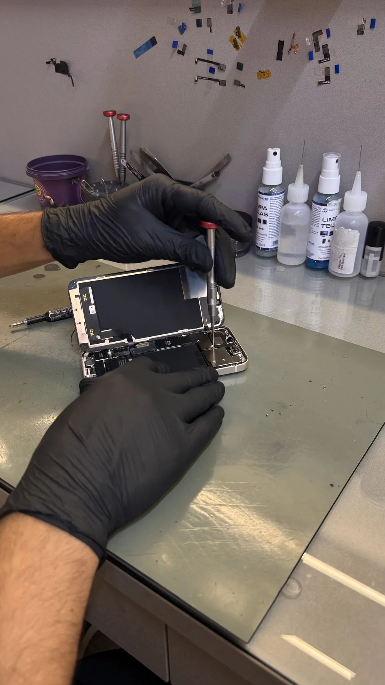

O celular caiu na água? Desligue o aparelho se puder fazer isso com segurança, retire os acessórios e seque a parte externa com um pano macio.

Não conecte o carregador nem use calor para acelerar a secagem. Mesmo que o aparelho volte a ligar, pode haver umidade interna.

## O que fazer quando o celular cai na água?

A primeira atitude é manter a calma e evitar mexer demais no aparelho. Quanto mais rápido você tomar os cuidados certos, maiores são as chances de reduzir danos internos.

- **Desligue o celular imediatamente:** se ele ainda estiver ligado, desligue para reduzir o risco de curto interno.
- **Remova capinha e acessórios:** tire capa, película solta, carregador, fone ou qualquer acessório conectado.
- **Seque a parte externa:** use um pano seco e macio para remover o excesso de água.
- **Não tente carregar:** conectar o carregador com o aparelho molhado pode piorar o problema.
- **Procure avaliação técnica:** mesmo que o celular volte a funcionar, pode haver umidade interna.

Em muitos casos, o aparelho pode parecer normal nos primeiros minutos ou horas, mas apresentar falhas depois. Por isso, o diagnóstico técnico é importante.

## O que não fazer quando o celular molha?

Algumas atitudes populares podem piorar a situação. Quando o celular cai na água, o ideal é evitar soluções caseiras que parecem ajudar, mas podem causar mais danos.

- **Não coloque no carregador:** energia elétrica e umidade não combinam.
- **Não use secador de cabelo:** calor excessivo pode danificar componentes internos.
- **Não coloque no micro-ondas:** isso pode destruir o aparelho e é perigoso.
- **Não sacuda o celular:** isso pode espalhar a água para outras áreas internas.
- **Não confie apenas no arroz:** o arroz não resolve oxidação interna e pode atrasar a avaliação correta.

O mais seguro é desligar o aparelho, secar a parte externa e levar para avaliação técnica o quanto antes.

## Água do mar: por que o sal exige atenção?

Quando o celular cai na água do mar, o risco pode ser maior por causa do sal. A água salgada favorece a oxidação e pode afetar conectores, placa, tela, câmera, microfone e outros componentes.

Em Bombinhas, esse tipo de situação é comum, principalmente com turistas e moradores que usam o celular na praia, em passeios de barco ou perto da piscina.

Se o celular teve contato com água do mar, não espere “secar sozinho”. Procure uma assistência técnica para avaliar possíveis sinais de oxidação.

## O celular voltou a ligar: ainda precisa de avaliação?

Sim, é recomendado fazer uma avaliação. Mesmo quando o celular liga normalmente depois de molhar, ainda pode existir umidade interna.

Essa umidade pode causar problemas com o passar do tempo, como falha no carregamento, tela piscando, áudio baixo, câmera embaçada, bateria descarregando rápido ou até o aparelho desligando sozinho.

Levar o celular para diagnóstico ajuda a identificar se existe risco de oxidação ou dano interno antes que o problema fique mais caro.

## Sinais de dano após contato com água

Depois que o aparelho molha, alguns sinais indicam que pode haver dano interno. Fique atento se o celular apresentar:

- **Falha no carregamento:** o conector pode ter sido afetado pela umidade.
- **Tela com manchas ou piscando:** pode indicar dano no display.
- **Áudio abafado:** alto-falante ou microfone podem estar comprometidos.
- **Câmera embaçada:** pode haver umidade na região da lente.
- **Celular desligando sozinho:** pode indicar falha na bateria, placa ou outros componentes.
- **Aquecimento incomum:** pode ser sinal de problema interno.

Mesmo que apenas um desses sinais apareça, vale procurar uma assistência técnica para evitar que o problema evolua.

*Avaliação na bancada da ReeCell. A foto ilustra o atendimento técnico, sem identificar o defeito tratado neste artigo.*

## Por que levar o aparelho para avaliação técnica?

Quando o celular cai na água, o maior problema nem sempre aparece na hora. A umidade pode atingir partes internas e iniciar um processo de oxidação.

Com uma avaliação técnica, é possível verificar se o aparelho precisa de limpeza interna, troca de algum componente ou apenas acompanhamento do funcionamento.

O diagnóstico também evita que você troque peças sem necessidade ou continue usando o aparelho com risco de falha futura.

## Onde levar celular molhado em Bombinhas?

Se o seu celular caiu na água em Bombinhas, você pode procurar a ReeCell para uma avaliação do aparelho.

A ReeCell pode analisar problemas relacionados a celular molhado, falha no carregamento, tela com defeito, bateria, conector de carga, câmera, áudio e outros danos causados por umidade.

## Perguntas frequentes sobre celular que caiu na água

### Posso colocar o celular no arroz?

Não é a melhor solução. O arroz pode até absorver parte da umidade externa, mas não remove água ou oxidação de componentes internos. Procure avaliação técnica.

### Posso carregar o celular depois que ele molhou?

Não é recomendado. Antes de conectar o carregador, o aparelho precisa ser avaliado para reduzir o risco de dano interno.

### O celular caiu na água e ligou normal. Está tudo bem?

Nem sempre. O aparelho pode funcionar no início e apresentar falhas depois. A umidade interna pode causar problemas com o tempo.

### Água do mar estraga mais o celular?

Sim. A água salgada pode aumentar o risco de oxidação e danificar componentes internos com mais facilidade.

### Quanto tempo devo esperar para levar na assistência?

O ideal é levar o quanto antes. Quanto mais tempo a umidade permanece dentro do aparelho, maior pode ser o risco de oxidação.

### Onde levar celular molhado em Bombinhas?

Você pode solicitar uma avaliação com a [atendimento da ReeCell](/contato-reecell-bombinhas/).

## Celular molhado: cuidados antes da avaliação

Se o celular caiu na água, evite carregar, aquecer ou insistir em ligar o aparelho. A aparência seca por fora não confirma que o interior está sem umidade.

Em Bombinhas, consulte a ReeCell sobre a avaliação. Informe o líquido envolvido, quando ocorreu o contato e quais falhas apareceram.
