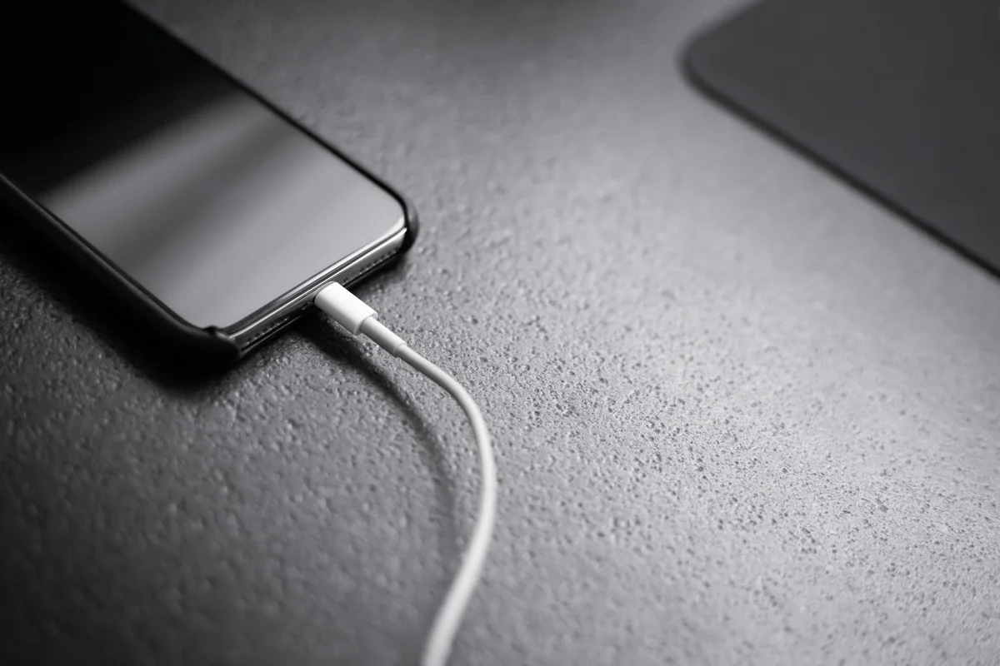

Um celular carregando lentamente pode ter problemas no cabo, no adaptador, na bateria ou no conector. O uso durante a carga e a temperatura também influenciam.

Compare o comportamento com a rotina habitual: quando começou, quais acessórios estavam conectados e se o aparelho esquentava. Não troque peças sem confirmar a causa.

## Principais causas do carregamento lento

Um celular pode começar a carregar devagar por desgaste natural, mau contato, sujeira no conector, uso de carregadores incompatíveis, bateria antiga ou falhas no próprio sistema.

Nem sempre o problema aparece de uma hora para outra. Muitas vezes, o carregamento vai ficando mais lento com o passar dos meses.

Também é comum o problema surgir depois de quedas, contato com umidade, exposição à maresia, uso na praia ou uso frequente de carregadores de baixa qualidade.

Em cidades litorâneas como Bombinhas, a combinação de areia, sal e umidade pode acelerar o desgaste do conector de carga e de outros componentes do celular.

## Como o adaptador influencia a velocidade?

Sim. Quando o celular está carregando lentamente, o primeiro item a verificar é o carregador.

Carregadores muito antigos, danificados, falsificados ou incompatíveis podem entregar menos energia do que o aparelho precisa. Isso faz com que a carga demore muito mais do que o normal.

Alguns sinais de que o problema pode estar no carregador são:

- O carregador esquenta demais durante o uso;
- O celular só carrega em determinada posição;
- O carregamento fica muito lento mesmo com pouca bateria;
- O carregador já foi usado por muito tempo;
- O acessório não é original ou não tem boa procedência.

Antes de concluir que o defeito está no celular, teste outro carregador compatível e de boa qualidade. Se o aparelho voltar a carregar normalmente, a causa provavelmente era o acessório.

*Cabo, adaptador e entrada de carga fazem parte da avaliação do carregamento.*

## O cabo também pode causar carregamento lento

Muita gente troca o carregador, mas esquece do cabo. O cabo USB também influencia diretamente na velocidade de carregamento.

Um cabo com fios internos danificados, pontas frouxas ou baixa qualidade pode fazer o celular carregar devagar ou interromper a carga várias vezes.

Um sinal clássico é quando o celular começa a carregar apenas quando o cabo fica em uma posição específica. Isso pode indicar mau contato no cabo ou no conector do aparelho.

Por isso, antes de insistir no uso, vale testar outro cabo adequado ao modelo do celular.

Usar cabo danificado não é uma boa ideia. Além de prejudicar o carregamento, pode causar aquecimento e falhas no conector de carga.

## Entrada do carregador suja ou com mau contato

Outro motivo muito comum para o celular carregando lentamente é sujeira acumulada na entrada do carregador. Poeira, fiapos de bolso, areia e resíduos podem impedir que o cabo encaixe corretamente.

Em regiões de praia, como Bombinhas, esse cuidado precisa ser ainda maior. A areia e a maresia podem afetar o encaixe do cabo e gerar oxidação nos contatos internos.

Quando isso acontece, o celular pode carregar devagar, falhar durante o carregamento ou parar de reconhecer o carregador.

Evite colocar objetos pontiagudos dentro da entrada do carregador. Isso pode danificar os contatos internos. Procure uma avaliação técnica quando houver suspeita de sujeira, oxidação ou mau contato.

## Quando investigar a bateria?

Sim. Bateria desgastada também pode fazer o celular carregar lentamente. Com o tempo, a bateria perde capacidade, esquenta mais e pode apresentar comportamento irregular.

Em alguns casos, o celular demora para carregar e descarrega rápido logo depois.

Alguns sinais de bateria ruim são:

- A carga demora muito para subir;
- O celular descarrega rápido mesmo sem uso intenso;
- O aparelho desliga sozinho;
- A porcentagem da bateria oscila;
- O celular esquenta durante o carregamento;
- A bateria não chega mais a 100% com facilidade.

Quando esses sintomas aparecem juntos, o problema pode não estar no carregador. Pode ser necessário avaliar a saúde da bateria e verificar se a troca é recomendada.

## Celular esquentando enquanto carrega é normal?

Um leve aquecimento durante o carregamento pode acontecer, principalmente se o celular estiver sendo usado ao mesmo tempo. Porém, aquecimento excessivo não deve ser ignorado.

Se o celular fica muito quente enquanto carrega, o problema pode estar no carregador, no cabo, na bateria ou em algum componente interno.

Também pode acontecer quando o aparelho está carregando em local abafado, exposto ao sol ou rodando muitos aplicativos em segundo plano.

Evite usar o celular para jogos, vídeos ou chamadas longas enquanto ele carrega. Isso aumenta o consumo de energia e pode deixar o carregamento mais lento.

## Aplicativos e sistema também influenciam no carregamento

Nem sempre o defeito é físico. Às vezes, o celular parece carregar lentamente porque está consumindo muita bateria ao mesmo tempo em que está conectado.

Aplicativos pesados, brilho alto, internet móvel, GPS e notificações constantes podem reduzir a velocidade aparente da carga.

Antes de levar para assistência, observe se muitos aplicativos estão abertos. Reiniciar o celular, atualizar o sistema e fechar aplicativos em segundo plano pode ajudar em alguns casos.

Mas se mesmo com pouco uso o celular continua carregando devagar, a causa pode estar no acessório ou no hardware do aparelho.

## Como saber se o problema é no carregador ou no celular?

Para identificar a origem do problema, faça testes simples e seguros:

- Teste outro cabo compatível;
- Teste outro carregador de boa qualidade;
- Teste outra tomada;
- Observe se o cabo encaixa firme;
- Veja se o celular esquenta demais;
- Confira se o carregamento falha ou para sozinho;
- Observe se a bateria descarrega rápido depois de carregar.

Se o celular carregar normalmente com outro carregador e outro cabo, o problema provavelmente estava nos acessórios.

Mas se continuar lento, pode haver defeito no conector, na bateria ou em algum componente interno.

## Quando procurar assistência técnica em Bombinhas?

Você deve procurar uma assistência técnica quando o celular carregando lentamente se torna frequente, quando o aparelho esquenta muito, quando o cabo não encaixa direito ou quando a bateria descarrega rápido demais.

Também é recomendado buscar avaliação se o celular teve contato com água, areia, maresia ou queda recente.

Esses fatores podem causar danos que não aparecem imediatamente, mas afetam o carregamento com o passar dos dias.

Uma avaliação técnica ajuda a evitar trocas desnecessárias. Às vezes, o cliente acredita que precisa trocar a bateria, mas o defeito está no conector de carga.

Em outros casos, troca o carregador, mas o problema está no aparelho.

## Vale a pena trocar a bateria ou o conector?

Depende do estado geral do celular. Se o aparelho ainda atende bem, não trava muito e está em boas condições, a troca de bateria ou conector pode valer a pena.

O conserto costuma ser mais econômico do que comprar um celular novo.

Por outro lado, se o aparelho já apresenta vários defeitos, tela danificada, sistema lento e bateria muito desgastada, vale pedir uma avaliação para comparar o custo do reparo com o valor de troca por outro aparelho.

## Como evitar que o celular carregue lentamente?

Alguns cuidados ajudam a preservar o carregamento do celular:

- Use carregadores e cabos de boa qualidade;
- Evite carregar o celular em locais muito quentes;
- Não use o aparelho intensamente enquanto carrega;
- Proteja o celular da areia e da maresia;
- Evite puxar o cabo com força;
- Não force o encaixe do carregador;
- Procure assistência ao perceber mau contato.

Esses cuidados reduzem o risco de danos no conector, na bateria e nos acessórios.

## Carregamento lento: por onde começar a avaliação

Se o celular está carregando lentamente, verifique os acessórios compatíveis e observe a temperatura e o consumo durante a carga.

Se a lentidão persistir, consulte uma avaliação em Bombinhas. Informe o modelo e os testes já feitos para investigar cabo, conector e bateria.
