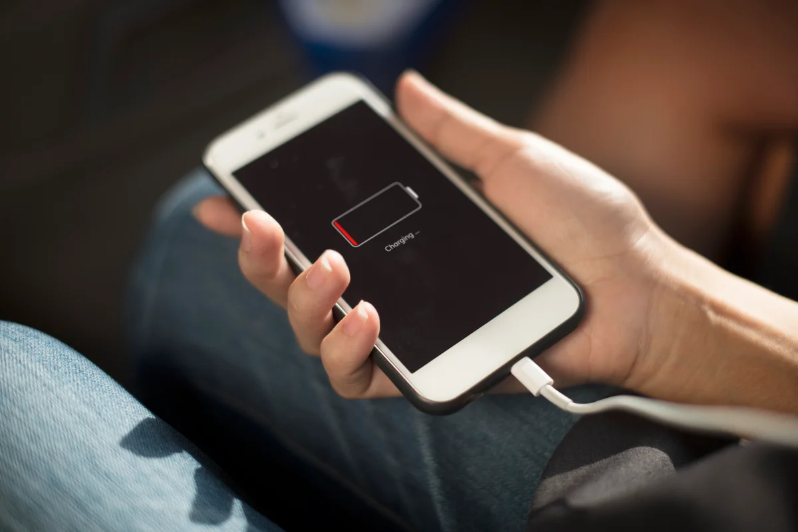

O celular desligando sozinho, mesmo com carga, pode ter falhas na bateria, no sistema ou em componentes internos. Aquecimento também deve ser observado.

Anote a porcentagem de carga e o que estava fazendo quando o aparelho desligou. Esses detalhes ajudam a investigar a causa sem trocar peças por tentativa.

## Por que o celular desliga sozinho?

Quando o celular começa a desligar sem motivo aparente, a causa pode estar em diferentes partes do aparelho.

Por isso, é importante observar quando a falha acontece: durante o uso, ao abrir aplicativos, ao carregar, com bateria baixa ou mesmo com carga alta.

- **Bateria desgastada:** o celular pode desligar mesmo indicando carga suficiente.
- **Sistema travando:** falhas de software podem causar reinicializações ou desligamentos.
- **Superaquecimento:** o aparelho pode desligar para tentar proteger os componentes.
- **Conector de carga com defeito:** mau contato pode afetar o fornecimento de energia.
- **Aplicativos problemáticos:** apps instáveis podem travar o sistema.
- **Falha na placa:** em casos mais complexos, pode haver defeito interno no circuito do aparelho.

Como os sintomas podem ser parecidos, o diagnóstico técnico ajuda a identificar a causa real e evita gastos desnecessários.

*O indicador de carga, sozinho, não confirma desgaste da bateria. Relate também a autonomia e os desligamentos.*

## Como identificar indícios de falha na bateria?

Sim. A bateria é uma das causas mais comuns quando o celular desliga sozinho, principalmente se o aparelho já tem alguns anos de uso ou descarrega muito rápido.

Uma bateria desgastada pode não conseguir entregar energia de forma estável, mesmo quando a porcentagem indica que ainda há carga disponível. Por isso, o celular pode desligar com 30%, 40% ou até mais.

Se o celular desliga mesmo com bateria aparente, descarrega rápido ou esquenta ao carregar, vale fazer um teste de bateria antes de trocar qualquer peça.

## Quando investigar o sistema?

Também pode. Falhas no sistema podem causar travamentos, reinicializações e desligamentos inesperados.

Isso pode acontecer depois de atualizações, instalação de aplicativos problemáticos ou falta de espaço interno.

Alguns sinais que podem indicar problema de sistema são lentidão, travamentos frequentes, tela congelando, aplicativos fechando sozinhos ou o aparelho reiniciando durante tarefas simples.

Em alguns casos, uma análise técnica pode identificar se o problema está relacionado ao software ou se há falha física no aparelho.

## Quando pode ser problema na placa?

A placa é uma das partes mais importantes do celular. Quando existe falha na placa, o aparelho pode desligar sozinho, não ligar, reiniciar em loop, aquecer demais ou apresentar vários defeitos ao mesmo tempo.

Problemas na placa podem surgir após queda, contato com água, oxidação, uso de carregadores inadequados ou desgaste de componentes internos.

Esse tipo de diagnóstico exige avaliação técnica, porque os sintomas podem ser parecidos com falha de bateria, sistema ou conector de carga.

- Sinais de possível falha na placa:
- O celular desliga mesmo após troca ou teste de bateria.
- O aparelho aquece muito sem motivo claro.
- O celular não liga ou reinicia várias vezes.
- O problema começou depois de queda ou contato com água.
- Vários componentes apresentam falhas ao mesmo tempo.

## Por que o celular desliga ao abrir aplicativos?

Se o celular desliga ao abrir câmera, jogos, redes sociais ou aplicativos mais pesados, pode haver problema de bateria, sistema, memória interna cheia ou superaquecimento.

Aplicativos que exigem mais desempenho aumentam o consumo de energia. Se a bateria estiver fraca ou instável, o aparelho pode desligar ao tentar executar tarefas mais pesadas.

Quando isso acontece com frequência, o ideal é avaliar o aparelho para identificar se o problema está na bateria, no sistema ou em algum componente interno.

## O que fazer antes de levar na assistência?

Antes de levar o celular para análise, você pode observar alguns pontos simples. Eles ajudam a explicar melhor o problema para o técnico e facilitam o diagnóstico.

- **Anote quando o problema acontece:** ao carregar, abrir aplicativos, usar câmera ou com bateria baixa.
- **Verifique se o aparelho esquenta:** aquecimento pode indicar falha de bateria, sistema ou placa.
- **Observe a porcentagem da bateria:** veja se ele desliga sempre em uma faixa parecida.
- **Evite usar carregadores ruins:** acessórios de baixa qualidade podem causar instabilidade.
- **Não tente abrir o aparelho:** isso pode danificar componentes internos.

Essas informações ajudam a assistência a identificar se o problema é mais provável na bateria, sistema ou placa.

## O que não fazer quando o celular desliga sozinho?

Quando o celular começa a desligar sozinho, é comum tentar resolver de qualquer forma. Mas algumas atitudes podem piorar o problema ou causar novos defeitos.

- **Não troque a bateria sem diagnóstico:** o problema pode estar em outro componente.
- **Não use carregadores de procedência duvidosa:** eles podem causar instabilidade e aquecimento.
- **Não ignore sinais de bateria estufada:** procure assistência rapidamente.
- **Não deixe o aparelho superaquecendo:** desligue e procure avaliação se o aquecimento for frequente.
- **Não tente consertar a placa em casa:** esse tipo de reparo exige ferramentas e conhecimento técnico.

O caminho mais seguro é fazer uma avaliação profissional antes de qualquer troca de peça.

## Onde diagnosticar celular desligando sozinho em Bombinhas?

Se o seu celular está desligando sozinho em Bombinhas, a ReeCell pode realizar uma avaliação para identificar se a falha está na bateria, sistema, placa, conector de carga ou outro componente.

A assistência pode analisar problemas como celular desligando, bateria descarregando rápido, aparelho que não liga, falha de carregamento, superaquecimento, celular molhado, tela com defeito e outros problemas comuns.

## Perguntas frequentes sobre celular desligando sozinho

### Por que meu celular desliga sozinho?

Pode ser bateria desgastada, falha de sistema, superaquecimento, problema no conector de carga, aplicativos travando ou defeito na placa.

### Celular desligando com bateria carregada é problema na bateria?

Pode ser, mas não é certeza. Uma bateria instável pode causar desligamentos mesmo com carga aparente, mas o sistema ou a placa também podem estar envolvidos.

### Celular desligando sozinho depois de molhar tem conserto?

Depende do nível de dano causado pela umidade. Faça uma análise técnica para verificar oxidação e possíveis componentes afetados.

### Trocar a bateria resolve celular desligando sozinho?

Resolve quando a causa é realmente a bateria. Por isso, o teste e o diagnóstico são importantes antes de trocar a peça.

### Quando o problema pode ser placa?

Pode ser placa quando o celular desliga mesmo com bateria boa, aquece demais, não liga, reinicia em loop ou apresenta vários defeitos ao mesmo tempo.

### Onde avaliar celular desligando sozinho em Bombinhas?

Você pode pedir um diagnóstico profissional com a [atendimento da ReeCell](/contato-reecell-bombinhas/).

## Desligamentos frequentes: registre os sintomas

Para avaliar um celular desligando sozinho, informe se a falha ocorre em repouso, durante aplicativos ou no carregamento.

Bateria, sistema e placa podem apresentar sintomas parecidos. Consulte uma avaliação na ReeCell em Bombinhas para definir o reparo.
