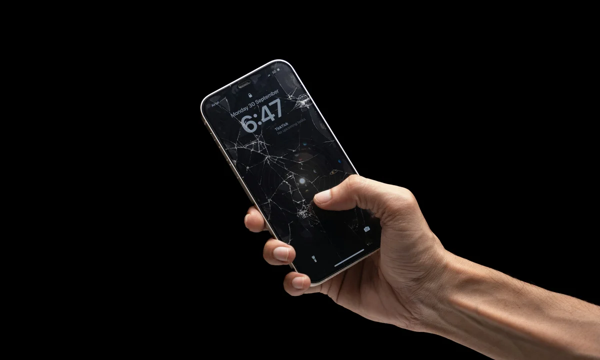

Está com o iPhone com tela quebrada em Bombinhas? Para decidir entre reparar e trocar de aparelho, compare o orçamento com o estado geral e o uso que você faz do celular.

Trincas no vidro, falhas no toque e ausência de imagem podem exigir reparos diferentes. Informe o modelo e descreva os danos ao pedir uma avaliação.

## Vidro, toque e imagem: identifique os sintomas

Antes de decidir pelo conserto, é importante entender que existem diferentes níveis de dano. Às vezes, apenas o vidro externo está trincado, mas o touch e a imagem continuam funcionando normalmente.

Em outros casos, a tela apresenta manchas, linhas, falhas no toque ou fica completamente preta.

- **Vidro trincado:** a imagem aparece normalmente, mas o vidro está rachado.
- **Touch falhando:** algumas partes da tela não respondem ao toque.
- **Linhas ou manchas:** o display pode ter sido danificado no impacto.
- **Tela preta:** o aparelho pode estar ligado, mas sem exibir imagem.
- **Face ID com falha:** sensores podem ter sido afetados pela queda.

Cada caso precisa ser avaliado com cuidado. Um iPhone que parece estar funcionando bem mesmo com a tela quebrada pode apresentar problemas maiores depois de alguns dias.

## Usar o iPhone com tela quebrada é perigoso?

Continuar usando o iPhone com a tela quebrada pode parecer uma solução temporária, mas envolve riscos. O primeiro é o risco físico: pequenos pedaços de vidro podem machucar os dedos ou o rosto durante ligações.

Além disso, a tela danificada deixa o aparelho mais vulnerável à entrada de poeira, areia, umidade e maresia. Em uma cidade de praia como Bombinhas, esse cuidado é ainda mais importante.

O contato com areia e umidade pode piorar o problema e atingir componentes internos do aparelho.

Se a tela do iPhone quebrou, evite usar o aparelho na praia, perto de água ou em locais com areia. A trinca pode facilitar a entrada de sujeira e umidade.

*Observe separadamente os danos no vidro, a resposta ao toque e a imagem exibida.*

## Quando vale a pena consertar a tela do iPhone?

Na maioria dos casos, vale a pena consertar quando o iPhone ainda está em bom estado geral.

Se o aparelho funciona bem, tem boa bateria, não trava muito e atende às suas necessidades, a troca da tela pode ser uma alternativa mais econômica do que comprar um celular novo.

- O conserto costuma valer a pena quando:
- O iPhone ainda é recente ou tem bom valor de mercado.
- O aparelho não apresenta outros defeitos graves.
- A bateria ainda segura carga bem.
- O custo da troca de tela é menor que comprar outro aparelho.
- Você pretende continuar usando o celular por mais tempo.
- Os dados do aparelho são importantes para você.

Antes de decidir, o ideal é pedir uma avaliação. Assim, você entende se o problema está somente na tela ou se a queda também afetou outros componentes.

## Quando comparar o reparo com outro aparelho?

Em alguns casos, o conserto pode não ser a melhor escolha.

Isso acontece quando o aparelho já está muito antigo, com bateria ruim, armazenamento insuficiente, outros defeitos acumulados ou custo de reparo muito próximo ao valor de outro celular.

Também é preciso atenção quando o iPhone sofreu uma queda forte e apresenta vários sintomas ao mesmo tempo, como tela quebrada, carcaça torta, câmera falhando, aquecimento e problemas de carregamento.

Nesses casos, uma assistência técnica pode avaliar o conjunto do aparelho e orientar se a troca da tela realmente compensa.

## Diferença entre vidro quebrado e display danificado

Muita gente chama tudo de “tela quebrada”, mas a tela do iPhone envolve mais de uma camada. O vidro externo é a parte que você toca. Já o display é responsável pela imagem.

Em muitos modelos, essas peças trabalham em conjunto.

Quando apenas o vidro trinca, o aparelho pode continuar exibindo imagem normalmente. Porém, quando o display é afetado, podem aparecer manchas, riscos, linhas verticais, falhas de brilho ou tela preta.

- **Pode ser apenas vidro quebrado:** a imagem aparece normal e o toque funciona bem.
- **Pode ser display danificado:** aparecem manchas, linhas, tela verde, tela preta ou falhas de brilho.
- **Pode ter afetado o touch:** a tela não responde bem ou abre coisas sozinha.
- **Pode ter afetado sensores:** Face ID, câmera frontal ou sensor de proximidade podem falhar após a queda.

## iPhone com tela quebrada pode perder resistência à água?

Sim. Mesmo modelos com algum nível de resistência à água podem ficar vulneráveis depois de uma queda ou troca de tela. Quando o vidro quebra, a estrutura de vedação pode ser comprometida.

Isso significa que o aparelho fica mais exposto à umidade, respingos, suor, areia molhada e maresia. Em Bombinhas, onde o celular costuma ser usado perto da praia, esse risco é ainda maior.

Por isso, se o seu iPhone caiu e quebrou a tela, evite levar o aparelho para a areia, piscina, barco ou locais úmidos até fazer uma avaliação.

## Cuidados antes de levar o iPhone para conserto

Antes de procurar assistência técnica, alguns cuidados simples podem ajudar a proteger seus dados e evitar mais danos ao aparelho.

- Faça backup dos seus dados, se possível.
- Evite pressionar a tela quebrada.
- Não use cola, fita ou produtos líquidos na tela.
- Evite contato com areia, água e umidade.
- Não tente abrir o aparelho em casa.
- Procure uma assistência com avaliação clara do serviço.

Se a tela estiver falhando muito e você não conseguir fazer backup, informe isso na assistência. Em alguns casos, o técnico pode orientar a melhor forma de preservar os dados.

## Como escolher uma assistência para iPhone em Bombinhas?

Escolher bem a assistência técnica é essencial.

O iPhone é um aparelho sensível, e a troca de tela precisa ser feita com cuidado para evitar danos em sensores, câmera frontal, alto-falante, Face ID e estrutura interna.

- Antes de autorizar o conserto, verifique:
- Se a assistência explica o diagnóstico com clareza.
- Se informa o tipo de tela utilizada.
- Se oferece garantia do serviço.
- Se avalia outros possíveis danos da queda.
- Se orienta sobre cuidados após o reparo.
- Se tem atendimento direto pelo WhatsApp.

Uma boa assistência não deve apenas trocar a tela. Ela deve avaliar o aparelho, explicar o problema e deixar claro o que será feito.

## O que pode acontecer se eu adiar o conserto?

Adiar o conserto pode transformar um problema simples em um prejuízo maior.

Uma tela trincada pode piorar, o touch pode parar de funcionar, a umidade pode entrar no aparelho e outros componentes podem ser afetados.

Além disso, quando o vidro está quebrado, o uso diário fica menos seguro. O aparelho pode apresentar falhas em momentos importantes ou simplesmente parar de responder.

Se você usa o iPhone para trabalho, WhatsApp, pagamentos, fotos ou atendimento de clientes, ficar com a tela quebrada por muito tempo pode atrapalhar bastante a rotina.

## Trocar a tela do iPhone apaga os dados?

Normalmente, a troca da tela não apaga fotos, conversas, aplicativos ou arquivos. O reparo é feito na parte física do aparelho.

Mesmo assim, sempre que possível, é recomendado fazer backup antes de qualquer manutenção.

O backup é uma medida de segurança, principalmente quando o aparelho sofreu queda forte, está com falhas no touch ou apresenta outros sintomas além da tela quebrada.

## Como comparar os custos do reparo e da substituição?

Para decidir, compare três fatores: valor do reparo, valor atual do aparelho e estado geral do iPhone.

Se o conserto representa uma parte pequena do valor de outro aparelho e o celular ainda funciona bem, consertar pode ser a melhor escolha.

Agora, se o iPhone já tem vários problemas, pouca memória, bateria ruim e não recebe mais atualizações importantes, talvez seja hora de considerar a troca.

Mesmo assim, a avaliação técnica é importante. Muitas vezes, o cliente acredita que o aparelho está perdido, mas o problema real é apenas a tela.

## Perguntas frequentes sobre iPhone com tela quebrada

### Vale a pena consertar iPhone com tela quebrada?

Sim, geralmente vale a pena quando o aparelho ainda está em bom estado, funciona bem e o custo do reparo é menor do que comprar outro iPhone.

### Posso continuar usando o iPhone com a tela trincada?

Não é o ideal. A tela trincada pode machucar, piorar com o tempo e facilitar a entrada de areia, poeira e umidade no aparelho.

### Tela quebrada pode afetar o Face ID?

Sim. Dependendo da queda, sensores próximos à parte frontal podem ser afetados, incluindo Face ID, câmera frontal e sensor de proximidade.

### Trocar a tela do iPhone apaga os dados?

Normalmente não. A troca da tela é um reparo físico. Mesmo assim, é recomendado fazer backup antes da manutenção, sempre que possível.

### iPhone com tela quebrada pode molhar?

Não é recomendado. A tela quebrada pode comprometer a vedação e facilitar a entrada de água, umidade e maresia.

### Onde consertar iPhone com tela quebrada em Bombinhas?

Você pode solicitar uma avaliação com a [atendimento da ReeCell](/contato-reecell-bombinhas/).

## Tela do iPhone: compare o reparo e o estado do aparelho

Para avaliar um iPhone com tela quebrada em Bombinhas, considere o tipo de dano, a bateria, outros defeitos e o custo total do serviço.

Consulte a peça proposta, os testes após o reparo e as condições de garantia. Se o aparelho permitir uso seguro, faça backup antes de entregá-lo.
